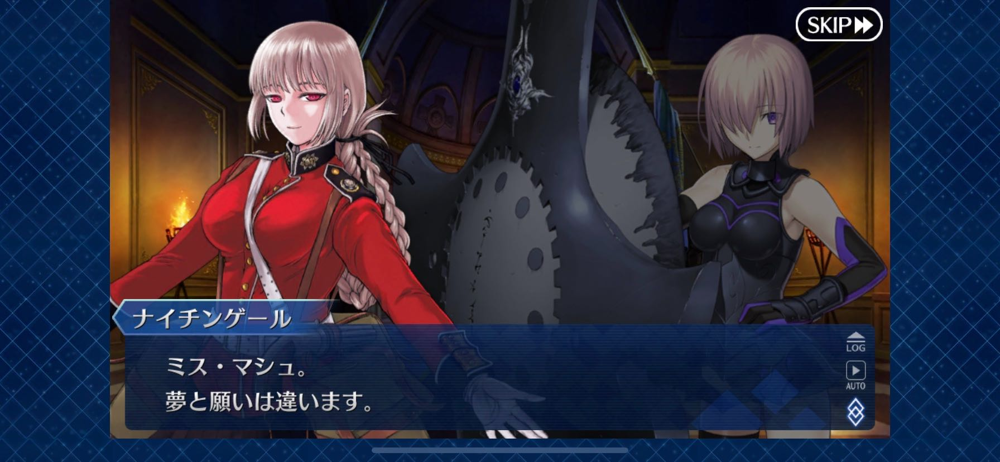
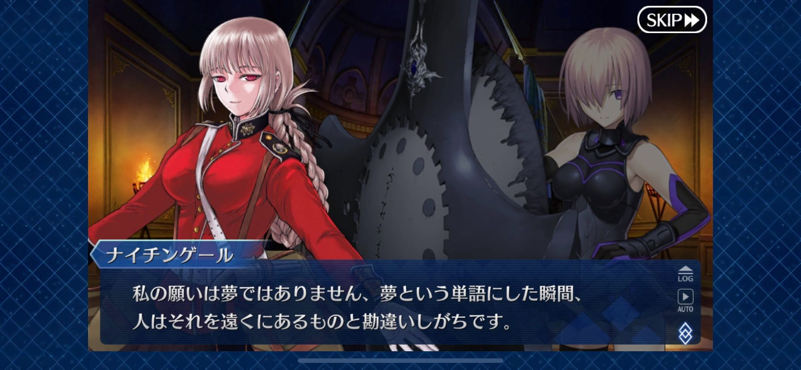
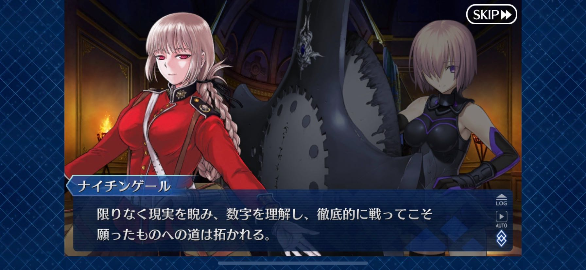
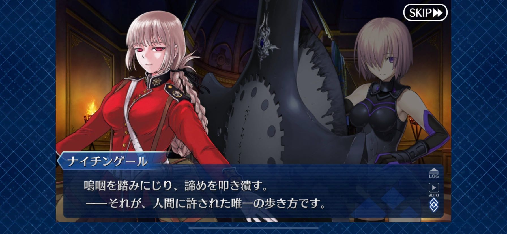

# FGO をやっている

かの有名な [FGO](https://www.fate-go.jp/) を 2019 年夏頃からプレイしている。
確か初めてやったイベントは、葛飾北斎（セイバー）が配布される水着イベだった。

面白いかっていうと、思ってたよりは面白かった。
楽しみどころとしては、敵の攻撃をスキルなどでしのぎつつ、攻撃が通るタイミングでバフをかけまくって一撃で落とす、という点である。

じゃあゲーム性があるのかというとさしてない。
いや誤解がないようにいうと、普通にコンシュマーのゲーム群もあんまりないと思ってるけど、それの平均点より若干出来が良い程度くらいのレベルでない。
勝てる道筋を考えるまでがゲームであるって感じ。そしてその後はひどい運ゲーである。
全体的にゲームシステムはこれはこういうものだと考えれば良いと思ってるけど、ただソシャゲって期待値がものすごい高いので（ひとつのゲームに何年も楽しませろって考えるの狂ってない？）、その需要を賄うほどでは流石になかったというところである。

そしてガチャですよ。ガチャはいいぞ。

ガチャって、好きなキャラを狙う派と強いキャラを狙う派に分かれると思ってて、自分は後者である。
石をためて、強いキャラを引いて、育成して、ステージをクリアする、ってのがソシャゲの（あんまり課金しないひとの）楽しみ方のある種の様式なんだけど、
FGO はちょっと特殊で石 1 個（ガチャには 3 個使う相場）で敵の損害状態を引き継いだまま連続コンティニューできちゃうので、正直ガチャ引くよりコンティニューしてクリアする方が大分安くなってて、そこに気づくと盛り下がるみたいのはあった。

ストーリーはまーたまーに良いシーンがあるって感想。
自分は Fate シリーズの例外また例外がバンバンでてくる話の流れがあんまり好きじゃないから、そもそもあんまり適正がないのかもしれない。
Fate の登場人物たちにはみんなに幸せになって欲しい。

以上です。最後に一番好きなシーンを画像テスト用に貼って終了にしとうございます。

